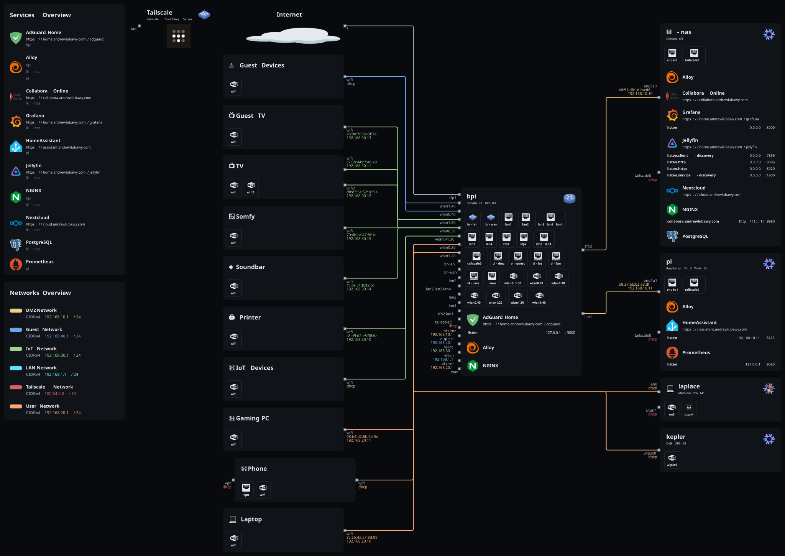
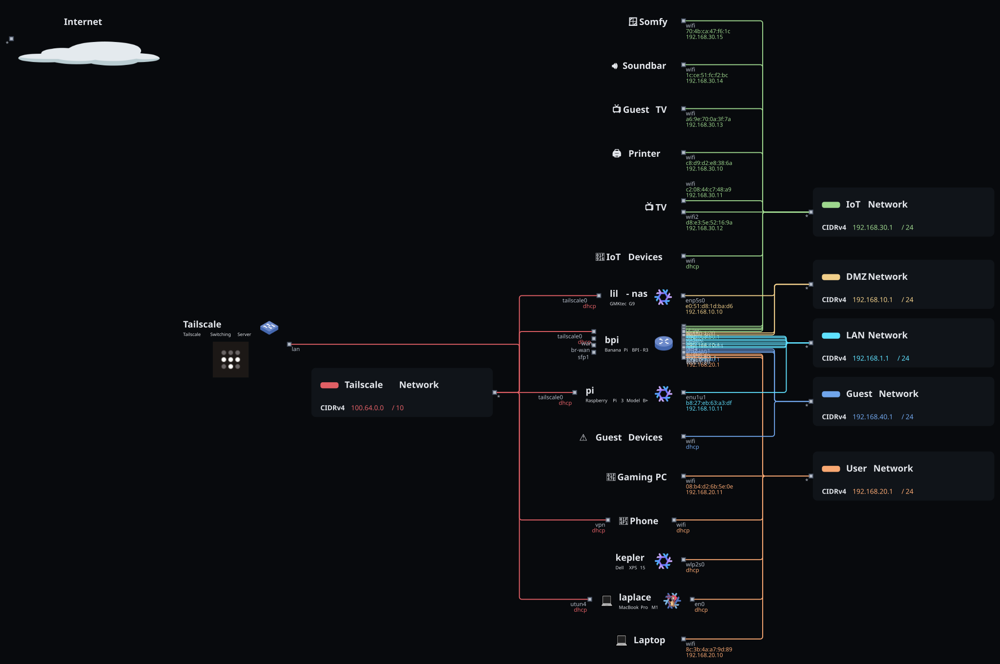

# Raspberry Pi 3 Model B+

This is a Raspberry Pi 3 Model B+ running NixOS from an SD card. It hosts Home Assistant, publishes the service through a Cloudflare Tunnel, and forwards local metrics and logs to `lil-nas` for centralized monitoring.

## Services

- **Home Assistant**: Home automation service exposed on `https://assistant.andrewlubawy.com`
- **Cloudflared**: Tunnel ingress for the Home Assistant domain
- **Matter Server**: Matter integration support for Home Assistant
- **Prometheus agent**: Local node metrics remote-written to `lil-nas`
- **Alloy**: Journal log shipping to Loki on `lil-nas`
- **Tailscale**: Secure remote access with Tailscale SSH enabled
- **Avahi**: mDNS service discovery
- **SSH**: Remote access (key-based authentication only)

## Installation

Installation assumes a Raspberry Pi 3 Model B+ booting from a 32 GB+ SD card with Ethernet connectivity for initial setup.

- Clone this repo: `git clone https://github.com/dlubawy/nix-configs.git`
- Enter where the repo was cloned: `cd nix-configs`
- Add or modify any users wanting to use the system in the `./users` module
  - Modify the `imports` to include/exclude the users for the system
- Edit `vars` in `flake.nix` to use your desired user's email acting as the system admin
- Change any static network configurations, tunnel credentials, and service secrets using `agenix`
- Run `just image pi` to build the initial SD card image or run `just build switch pi` from an existing installation
- Using a 32 GB+ SD card (skip if using an existing pi image)
  - Insert the SD card and identify the correct disk device (`fdisk` on Linux or `diskutil` on macOS)
  - Run `nix run nixpkgs#zstdcat ./result/sd-image/nixos-sd-image-*.img.zst | dd of=<disk> status=progress bs=64M`
  - Insert the SD card into the Raspberry Pi and boot it
- Connect over the local network or Tailscale and change the initial password with `passwd`

## Notes

- The host imports `nixos-hardware` support for Raspberry Pi 3 and disables ZFS support
- Home Assistant data is stored in a Podman volume named `home-assistant`
- The default Home Assistant domain can be overridden with the `homeAssistantDomain` option
